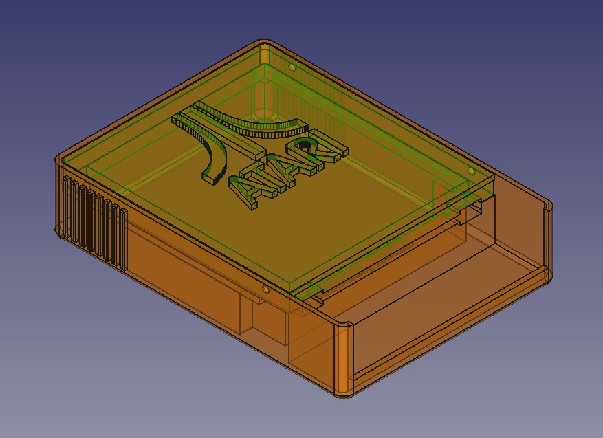

# ATARI SXEGS Cartridge

## Cartridge board and Housing for [ATARI 65XE/130XE/800XE/800XL](https://en.wikipedia.org/wiki/Atari_8-bit_family) 8-bit computers based on [SST39SF040](https://www.microchip.com/en-us/product/SST39SF040) CMOS multi-purpose **Flash memory** chip.

- This is a **[S/XEGS type cartridge](https://forums.atariage.com/topic/276194-switchable-xe-game-cartridges-swxegs-andor-sxegs/)** that allows you to store and run dozens of games.
- The project **does not use** programmable logic chips such as [GAL-chips](https://en.wikipedia.org/wiki/Generic_array_logic).
- Only conventional logic chips are used, such as **74LS00N**, **74LS74N** and **74LS374N**.
- In the process of manufacturing a cartridge, microchips of Russian production can be used, such as **ЭКР1533ИР23**, **К555ТМ2**, **К555ЛА3** etc.

The ROM files for the cartridge are created from the XEX files using the [CreaXin1](http://chomikuj.pl/ccwrc/users/XEGS/x_angel_ccwrc_atari_custom_cart,6059920787.7z(archive)) utility,
and then merged using the [XEGS Merger](http://chomikuj.pl/ccwrc/users/XEGS/x_angel_ccwrc_atari_custom_cart,6059920787.7z(archive)) to combine four files into one, forming a total of 512 kb of ROM memory.

The cartridge body consists of two 3D-printed parts. The parts connect to each other without the use of screws or glue.

Files:
- ***[XEGS Cartridge_2022-11-05.zip](XEGS%20Cartridge_2022-11-05.zip)*** - archive with Gerber files for PCB manufacturing
- ***[ATARI-Cartridge-v2-Body.stl](ATARI-Cartridge-v2-Body.stl)*** - 3D-model of cartridge housing body
- ***[ATARI-Cartridge-v2-Cover.stl](ATARI-Cartridge-v2-Cover.stl)*** - 3D-model of cartridge housing cover

**[Ready to order project on PCBWay here](https://www.pcbway.com/project/shareproject/W256652ASG3_XEGS_Cartridge_2022_11_05_4d701522.html)**

The following DIP chips are required to build a cartridge:
- SST39SF040 DIP32 (1pcs)
- 74LS374N (or ЭКР1533ИЗ23) DIP20 (1pcs)
- 74LS74N (or К555ТМ2) DIP14 (1pcs)
- 74LS00N (or К555ЛА3) DIP14 (1pcs)

And the following SMD 1206 parts are required to build a cartridge:
- 100 nF capacitors (3 pcs)
- 6.8 uF capacitor (1 pcs)
- 11 kOhm resistors (6 pcs)
- 3.3 kOhm resistor (1 pcs)

Optional: Round Hole IC Socket Connector DIP32 (1pcs) for SST39SF040.

And you need the ability to program the [SST39SF040](https://www.microchip.com/en-us/product/SST39SF040) Flash ROM, of course. Some sort of programmer like TL866II, or something else.

To make a cartridge body, you need the ability to print models on a 3D printer. The model of the cartridge case and its cover is attached.

When assembling the case, no additional fasteners, screws or glue are required. The case cover simply snaps into the body of the case, securing the PCB.

 

