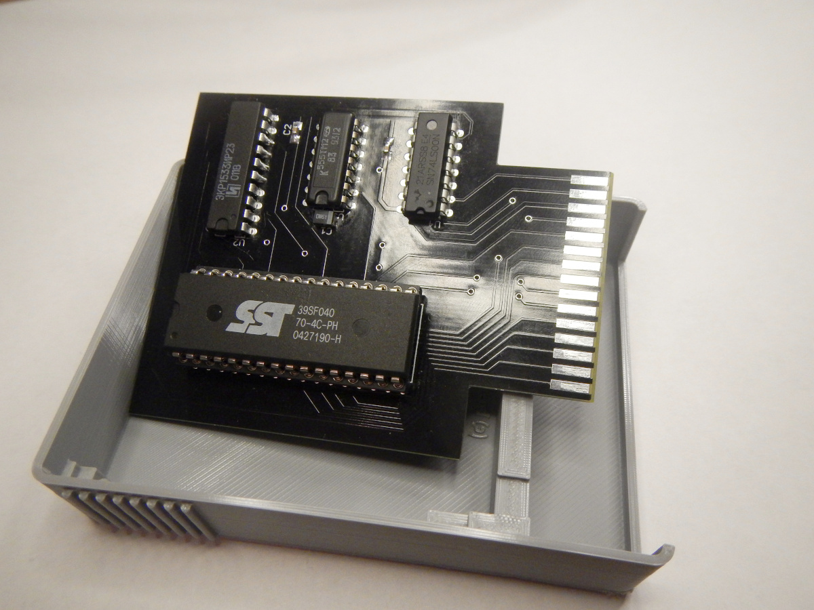

# ATARI SXEGS Cartridge

## Cartridge board for ATARI 65XE/130XE/800XE/800XL 8-bit computers based on SST39SF040 CMOS multi-purpose Flash memory chip.

The project does not use programmable logic chips such as GAL-chips.

Only conventional logic chips are used, such as 74LS00N, 74LS74N and 74LS374N.

This is a S/XEGS type cartridge that allows you to store and run dozens of games.

The ROM files for the cartridge are created from the XEX files using the CreaXin1 utility,

and then merged using the XEGS Merger to combine four files into one, forming a total of 512 kb of ROM memory.

In the process of manufacturing a cartridge, microchips of Russian production can be used, such as ЭКР1533ИР23, К555ТМ2, К555ЛА3 etc.

The cartridge body consists of two 3D-printed parts. The parts connect to each other without the use of screws or glue.

Files:
*XEGS Cartridge_2022-11-05.zip* - archive with Gerber files for PCB manufacturing
*ATARI-Cartridge-v2-Body.stl* - 3D-model of cartridge housing body
*ATARI-Cartridge-v2-Cover.stl* - 3D-model of cartridge housing cover
